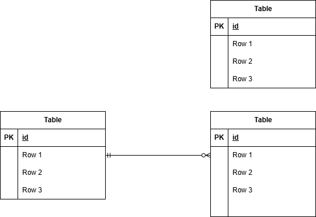

## アプリケーション名

確認テスト第一号

## 環境構築

git cloneコマンドでリポジトリからダウンロード
「.env.example」をコピーして「.env」を作成しDBの設定を変更

cp .env.example .env

DB_CONNECTION=mysql
DB_HOST=mysql
DB_PORT=3306
DB_DATABASE=laravel_db
DB_USERNAME=laravel_user
DB_PASSWORD=laravel_pass

dockerコンテナを構築

docker-compose up -d --build

phpコンテナにログインしてLaravelをインストール

docker-compose exec php bash
composer install

アプリケーションキーを作成

php artisan key:generate

DBのテーブルを作成

php artisan migrate

DBのテーブルにダミーデータを投入

php artisan db:seed

"The stream or file could not be opened"エラーが発生した場合
srcディレクトリにあるstorageディレクトリに権限を設定

chmod -R 777 storage

## 使用技術(実行環境)

PHP：8.1.x
Laravel：10.x.x
MySQL：8.0.x
Nginx：1.2x.x

## URL

トップページ：http://localhost/
管理画面：http://localhost/admin

